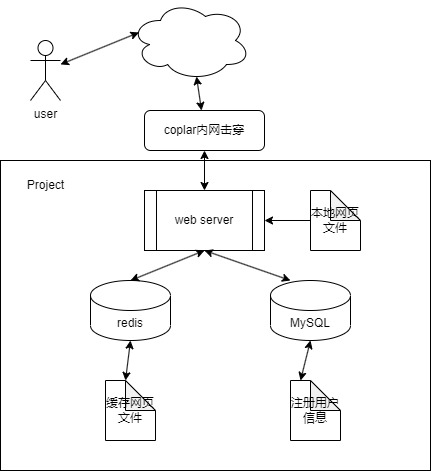

# 关于本项目

1. 本项目是在MARK大佬基础上做的：https://github.com/markparticle/WebServer

2. 有关项目编译、配置等问题可参见上面链接。
3. 原项目注释较少，增加了部分重要代码注释。

# 我的开发
  - [x] 完成Cookie功能，使用MD5加密。
  - [x] 新增文件上传功能，修改读缓存bug。
  - [x] 新增文件下载功能。
  - [x] 解决大文件上传bug（增加post大数据量分段传输时服务端处理逻辑）。
  - [x] 新增主页访问量显示（前端ajax发送GET请求，后端增加对非文件GET请求响应）。
  - [x] 增加服务器对信号的处理，改写SIGHUP信号处理，使服务器可以以守护进程运行。
  - [x] 增加Redis缓存和连接池，进一步封装hiredis库。
  - [x] 重写了更加简洁高效的线程池（threadpoolv2.h）
  - [x] 增加docker打包功能，在docker-version分支中使用Dockerfile一键部署web服务

# 注意
- 在根目录运行 `/bin/server` 启动服务器
- 在根目录运行 `redis-server ./code/redis/redis.conf` 启动Redis
- MySQL如果不想记录注册、登陆界面信息，可以不开。
- redis默认AOF持久化
- redis缓存让qps骤降，因为原项目的资源文件部署在服务端本地，开本地文件会比redis查key快。若资源不在本地的情况，redis缓存才有加速作用。
## Docker
- `docker-version`分支中数据库方面只采用redis，不再使用mysql
- 根目录运行 `docker build -t webserver:v1 .` 根据Dockerfile创建镜像
- 根目录运行 `docker run -it -p 9006:9006 --name server webserver:v1` 将本机9006端口映射到容器9006端口（web服务的端口）并启动容器
- 目前server不稳定，若出现无法访问服务器现象，删除容器重启即可